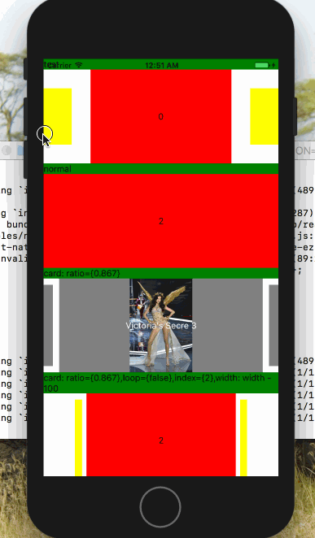
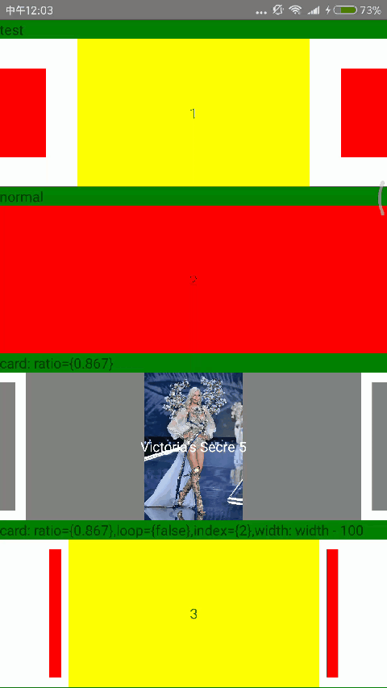
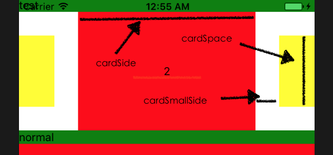

# react-native-ezswiper

[![NPM version][npm-image]][npm-url]
[](https://github.com/easyui/react-native-ezswiper/releases)
[](https://raw.githubusercontent.com/joeferraro/react-native-ezswiper/master/LICENSE.md)

源码靠谱、简单，容易使用的轮播react native组件。


## 安装

```
$ npm install react-native-ezswiper --save
```

## 预览

  


## 使用

引入组件：

```js
import EZSwiper from 'react-native-ezswiper';
```

### 简单轮播

```js
<EZSwiper style={{width: width,height: 150,backgroundColor: 'white'}}
          dataSource={['0', '1' ,'2','3']}
          width={ width }
          height={150 }
          renderRow={this.renderRow}
          onPress={this.onPressRow}                      
          />
```

### 卡片轮播

```js
<EZSwiper style={{width: width,height: 150,backgroundColor: 'white'}}
           dataSource={images}
           width={ width }
           height={150 }
           renderRow={this.renderImageRow}
           onPress={this.onPressRow} 
           ratio={0.867}                    
                    />
```

### 高级属性配置

```js
<EZSwiper style={{width: width,height: 150,backgroundColor: 'white'}}
                    dataSource={['0', '1' ,'2','3']}
                    width={ width }
                    height={150 }
                    renderRow={this.renderRow}
                    onPress={this.onPressRow} 
                    index={2}                
                    cardParams={{cardSide:width*0.867, cardSmallSide:150*0.867,cardSpace:width*(1-0.867)/2*0.2}}  
                    />
```

### 竖向轮播

```js
<EZSwiper style={{width: width,height: 200,backgroundColor: 'white'}}
          dataSource={['0', '1' ,'2','3']}
          width={ width }
          height={200 }
          renderRow={this.renderRow}
          onPress={this.onPressRow} 
          ratio={0.867} 
          horizontal={false}  
                    />
```
## API

### 属性

| 属性 | 类型 | 默认值 | 描述 |                 
| --- | --- | --- | --- |
| width | PropTypes.number.isRequired |  | 轮播组件宽度 |
| height | PropTypes.number.isRequired |  | 轮播组件高度 |
| index | PropTypes.number | 0 | 轮播默认显示项 |
| horizontal | PropTypes.bool | true | 是否横向滚动 |
| loop | PropTypes.bool | true | 是否循环 |
| autoplayTimeout | PropTypes.number | 5 | 自动轮播时间，单位是秒 |
| autoplayDirection | PropTypes.bool | true | true代表朝着卡片索引大的方向 |
| ratio | PropTypes.number | 1 | 轮播卡片缩放，默认不缩放 |
| cardParams | PropTypes.object | {} | 轮播卡片缩放高级参数设置，详见备注 |
| renderRow | PropTypes.func.isRequired | | 轮播卡片渲染|
| onPress | PropTypes.func | | 轮播卡片点击事件 |
| onWillChange | PropTypes.func | | 轮播某卡片将要显示 | 
| onDidChange | PropTypes.func | | 轮播某卡片已显示 |
 
#### cardParams属性是个对象：`{cardSide,cardSmallSide,cardSpace}`


### 方法
| 方法 | 描述 |                    
| --- | --- | 
| scrollTo(index, animated = true) | 滚动到指定位置 |


## License
react-native-ezswiper遵守MIT协议，具体请参考MIT.


[npm-image]: https://img.shields.io/npm/v/react-native-ezswiper.svg?style=flat-square
[npm-url]: https://npmjs.org/package/react-native-ezswiper
[travis-image]: https://img.shields.io/travis/yorkie/react-native-ezswiper.svg?style=flat-square
[travis-url]: https://travis-ci.org/yorkie/react-native-ezswiper
[david-image]: http://img.shields.io/david/yorkie/react-native-ezswiper.svg?style=flat-square
[david-url]: https://david-dm.org/yorkie/react-native-ezswiper
[downloads-image]: http://img.shields.io/npm/dm/react-native-ezswiper.svg?style=flat-square
[downloads-url]: https://npmjs.org/package/react-native-ezswiper
[React Native]: https://github.com/facebook/react-native
[react-native-cn]: https://github.com/reactnativecn
[react-native-ezswiper]: https://github.com/easyui/react-native-ezswiper
[Linking Libraries iOS Guidance]: https://developer.apple.com/library/ios/recipes/xcode_help-project_editor/Articles/AddingaLibrarytoaTarget.html

